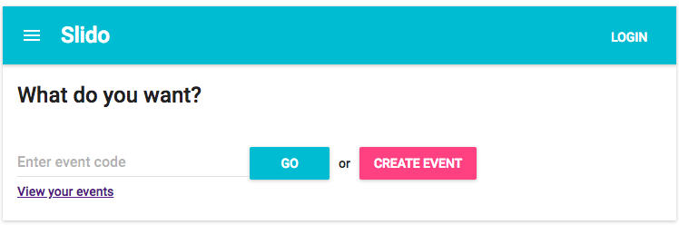

# Slido

A clone version of [Sli.do](https://www.sli.do/) with below technical stack.

- Frontend: ReactJS/Redux/Material-UI/Parcel/Jest/Enzyme
- Backend: KoaJS/Sequelize/Sqlite/Jest/Supertest
- Development Environment: Babel/ESlint

Database schema:

- Users(id, email, fullName, password, createdAt, updatedAt)
- Events(id, code, name, createdBy, startsAt, endsAt, createdAt, updatedAt)
- Questions(id, content, eventId, isHighlight, like, dislike, createdAt, updatedAt)

### Usage

After clone the project, please run `setup.sh` for setup your development environment. This script will run migration to create sqlite db file in `/server` directory.

Run `server_dev.sh` for start your server.
Run `client_dev.sh` for start your client.

After all, you can access the application through `http://localhost:1234`

### Limitation

This is some limitation at the current time.

- [ ] Event creator cannot edit audience question
- [ ] Event creator cannot highlight audience question
- [ ] Audience can like/dislike questions multiple time if they refresh the page
- [ ] Audience cannot sort question list
- [ ] Lack of validations from both server and client sides
- [ ] Not enough unit test
